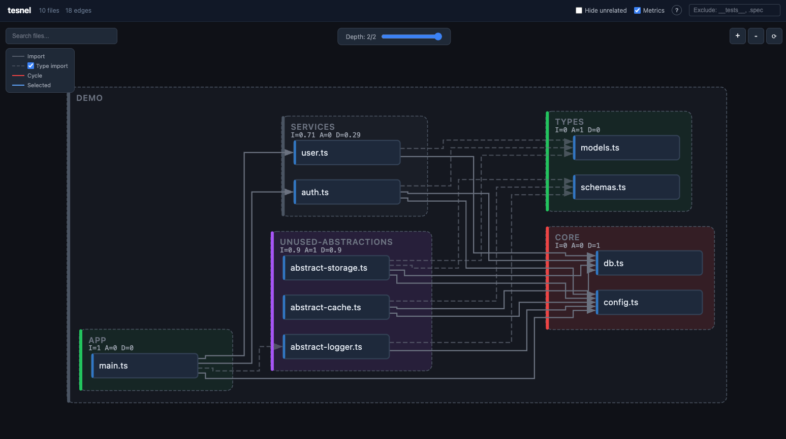

# tesnel

<div align="right"><a href="./README.ru.md">Русский</a></div>

> Built with [Claude Code](https://claude.ai/code)

[](https://www.npmjs.com/package/@gevvos/tesnel)
[](https://github.com/gevvos/tesnel/actions/workflows/ci.yml)
[](./LICENSE)

**Static source-level dependency graph analyzer and visualizer** for TypeScript, JavaScript, and Vue projects.

> **tesnel** (տեսնել, pronounced *tes-nel*) — "to see" in Armenian.

## Why

Understanding how files depend on each other in a large codebase is hard. IDE tools show imports for one file at a time, but they don't reveal the full picture — which modules are tightly coupled, where circular dependencies hide, or how a change in one file ripples through the project.

**tesnel** analyzes your source code **before any build step** — no bundler, no compilation, no dev server needed. It reads raw `.ts`, `.vue`, and `.js` files, resolves imports (including tsconfig aliases and Nuxt auto-imports), and produces an interactive graph you can explore in the browser.

It's fast: **290 files analyzed in ~400ms**, output is a single self-contained HTML.

Use it to:
- **Audit architecture** — see the real dependency structure, not what you think it is
- **Find circular dependencies** — before they cause subtle bugs or prevent tree-shaking
- **Onboard to a codebase** — understand module boundaries and key hub files at a glance
- **Review refactors** — verify that a restructuring actually reduced coupling
- **Filter noise** — hide test files, type-only imports, or unrelated modules to focus on what matters

### For AI coding agents

tesnel includes an MCP server that gives AI agents (Claude Code, etc.) structured access to the dependency graph. Without it, an agent has to read files one by one — hundreds of tool calls and tens of thousands of tokens just to understand project structure. With tesnel, one MCP call returns the full picture: what imports what, who depends on a given file, where the cycles are. It's the difference between walking through a city street by street and looking at a map.

## Features

- **Recursive dependency analysis** from entry point or directory
- **Interactive graph visualization** — nested directories, file nodes, dependency arrows
- **Cycle detection** — circular dependencies highlighted in red
- **Type-import distinction** — dashed lines for `import type`, toggleable
- **Depth control** — collapse/expand directory nesting
- **Filters** — isolate selected file, show cycles only, exclude by pattern
- **Vue SFC support** — parses `<script setup>` from `.vue` files
- **Nuxt support** — detects auto-imported composables and stores via `.nuxt/types/`
- **Nest.js support** — works out of the box with explicit imports
- **tsconfig paths** — resolves `@/`, `~/`, and custom aliases
- **Architecture metrics** — Instability, Abstractness, Distance per directory (Robert Martin)
- **File complexity** — cyclomatic complexity bar on each file node (green → red)
- **File stats** — LOC, complexity, functions, nesting depth in sidebar
- **Export tracking** — list of exports per file, click to filter graph to consumers of a specific symbol
- **Cycle linting** — `tesnel lint` with exit code 1 for CI pipelines
- **MCP server** — Claude Code integration for querying the dependency graph
- **Single HTML output** — self-contained, works offline via `file://`

## Install

```bash
npm install -g @gevvos/tesnel
# or
pnpm add -g @gevvos/tesnel
```

## Usage

### Analyze a project

```bash
# From entry file
tesnel analyze ./src/main.ts

# From directory (all .ts/.vue/.js files)
tesnel analyze ./src

# Custom output path
tesnel analyze ./src/main.ts -o deps.json

# Limit traversal depth
tesnel analyze ./src/main.ts --depth 3

# JSON only, no HTML
tesnel analyze ./src/main.ts --no-html
```

Output: `.tesnel/output.json` + `.tesnel/output.html`

### Open the visualization

Open `.tesnel/output.html` in any browser. No server needed.

**Controls:**
- **Zoom** — scroll or +/- buttons
- **Pan** — click and drag
- **Depth slider** — collapse directories
- **Click file** — show file stats, exports, imports/importedBy in sidebar
- **Search** — find files by name
- **Hide unrelated** — isolate selected file's connections
- **Cycles only** — show only circular dependencies
- **Exclude** — hide files matching pattern (e.g. `__tests__, .spec`)
- **Type imports** — toggle type-only imports (dashed lines)
- **Metrics** — toggle architecture metrics overlay on directories

### Architecture metrics

tesnel computes per-directory architecture metrics based on Robert Martin's *Clean Architecture* component principles:

- **Instability (I)** = Fan-out / (Fan-in + Fan-out) — how likely the module is to change
- **Abstractness (A)** = type-only imports / total incoming imports — how abstract the module is
- **Distance (D)** = |A + I − 1| — distance from the ideal Main Sequence

Enable the **Metrics** toggle in the visualization header to see directories colored by zone:



| Zone | Color | Condition | Meaning |
|------|-------|-----------|---------|
| Zone of Pain | Red | A ≈ 0, I ≈ 0 | Concrete + stable. Everyone depends on it, hard to change |
| Zone of Uselessness | Purple | A ≈ 1, I ≈ 1 | Abstract + unstable. Abstractions nobody uses |
| Main Sequence | Green | D < 0.2 | Good balance between stability and abstractness |

Click a directory in the graph to see full metrics in the sidebar. The `?` button opens a detailed explanation.

> **Note:** Being in a zone is not automatically bad. Constants, configs, and utilities are naturally in the Zone of Pain — the question is whether a change there would cause a cascade of breakage.

Metrics are included in the JSON output under the `metrics` key.

### Lint for circular dependencies

```bash
# Check from entry file
tesnel lint ./src/main.ts

# Check entire directory
tesnel lint ./src

# Limit traversal depth
tesnel lint ./src --depth 3
```

Exits with code 0 if no cycles found, code 1 otherwise. Useful in CI pipelines:

```yaml
- run: tesnel lint ./src
```

### MCP server (Claude Code)

Give AI agents structured access to your dependency graph — no need to read files one by one.

**1. Analyze your project first:**

```bash
tesnel analyze ./src/main.ts
```

**2. Connect to Claude Code:**

```bash
# npm
claude mcp add --transport stdio tesnel -- npx -y @gevvos/tesnel mcp

# pnpm
claude mcp add --transport stdio tesnel -- pnpm dlx @gevvos/tesnel mcp
```

That's it. Restart Claude Code and the tools are available.

**How it works:** Claude Code launches `npx -y @gevvos/tesnel mcp` in your project directory. The server reads `.tesnel/output.json` and exposes 5 read-only tools over stdio.

**Custom data path:**

```bash
claude mcp add --transport stdio tesnel -- npx -y @gevvos/tesnel mcp --data ./deps.json
```

**Share with your team** by adding a `.mcp.json` to your repo root:

```json
{
  "mcpServers": {
    "tesnel": {
      "command": "npx",
      "args": ["-y", "@gevvos/tesnel", "mcp"]
    }
  }
}
```

Everyone who clones the repo gets the MCP server automatically.

**Or install the Claude Code plugin** to get MCP tools + a `/tesnel` skill in one package:

```bash
claude plugin marketplace add https://github.com/gevvos/tesnel
claude plugin install tesnel@tesnel-marketplace
```

**Available tools:**

| Tool | Description |
|------|-------------|
| `tesnel_get_stats` | Project overview: files, edges, cycles |
| `tesnel_get_structure` | Directory tree (with depth limit) |
| `tesnel_get_file_info` | Imports and importedBy for a file |
| `tesnel_get_cycles` | All circular dependencies |
| `tesnel_get_metrics` | Architecture metrics per directory (I, A, D) |

## Supported projects

| Framework | How it works |
|-----------|-------------|
| **React** | Explicit imports — works out of the box |
| **Vue** | `.vue` SFC parsed via `@vue/compiler-sfc` |
| **Nuxt** | Auto-imports detected from `.nuxt/types/imports.d.ts` |
| **Nest.js** | Explicit imports — works out of the box |
| **Angular** | Standard TS imports — works out of the box |
| **Any TS/JS** | Static imports and re-exports |

## Graph legend

| Visual | Meaning |
|--------|---------|
| Dashed border, gray accent | Directory |
| Solid border, green left bar | `.vue` file |
| Solid border, blue left bar | `.ts` / `.tsx` file |
| Solid border, yellow left bar | `.js` / `.jsx` file |
| Solid arrow | Runtime import |
| Dashed arrow | Type-only import |
| Red arrow | Circular dependency |
| Blue arrow | Selected file's connections |
| Bottom bar (green → red) | File cyclomatic complexity |

## Development

```bash
pnpm install
pnpm test          # run tests
pnpm build         # build UI + CLI
pnpm dev analyze ./src/main.ts  # run CLI in dev mode
```

## Tech stack

- [oxc-parser](https://www.npmjs.com/package/oxc-parser) — fast AST parsing
- [oxc-resolver](https://github.com/oxc-project/oxc-resolver) — module resolution with tsconfig support
- [ELK.js](https://github.com/kieler/elkjs) — hierarchical graph layout
- [Vue 3](https://vuejs.org) + [D3.js](https://d3js.org) — interactive visualization
- [@modelcontextprotocol/sdk](https://github.com/modelcontextprotocol/typescript-sdk) — MCP server
- [Vite](https://vite.dev) — build tooling
- [Vitest](https://vitest.dev) — testing

## License

ISC
