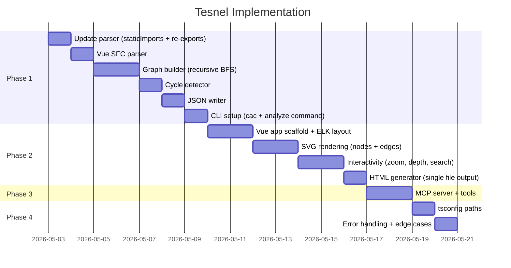

# Tesnel — Полный план реализации

> Статический анализатор зависимостей: CLI → JSON → Static HTML (Vue + D3 + ELK.js) + MCP Server

## Overview

Tesnel анализирует TypeScript/JavaScript проект из entry point, строит полный граф зависимостей, определяет циклы, генерирует JSON и статичную HTML визуализацию с интерактивным графом. Отдельный MCP сервер позволяет Claude Code получать структурированную информацию о проекте из JSON.

## Architecture

```
┌─────────────────────────────────────────────────────┐
│  CLI: tesnel analyze <entry> [options]               │
│                                                      │
│  ┌──────────┐   ┌──────────┐   ┌───────────────┐   │
│  │ Resolver │──▶│  Parser  │──▶│ Graph Builder │   │
│  └──────────┘   └──────────┘   └───────┬───────┘   │
│                                         │           │
│                               ┌─────────▼────────┐  │
│                               │ Cycle Detector   │  │
│                               └─────────┬────────┘  │
│                                         │           │
│                      ┌──────────────────▼────────┐  │
│                      │  JSON Writer              │  │
│                      └──────────┬────────────────┘  │
│                                 │                   │
│               ┌─────────────────▼──────────────┐    │
│               │  HTML Generator (Vue app embed)│    │
│               └────────────────────────────────┘    │
└─────────────────────────────────────────────────────┘

┌─────────────────────────────────────────────────────┐
│  MCP Server: tesnel mcp [--data <path>]              │
│                                                      │
│  Читает JSON → отвечает на tool calls               │
│  Tools: get_structure, get_file_info, get_cycles     │
└─────────────────────────────────────────────────────┘

┌─────────────────────────────────────────────────────┐
│  Static HTML (открывается в браузере)                │
│                                                      │
│  Vue 3 + D3.js + ELK.js                            │
│  JSON встроен как <script type="application/json">  │
│  Nested rectangles + arrows + depth slider           │
└─────────────────────────────────────────────────────┘
```

## Technical Decisions

| Решение | Выбор | Почему |
|---------|-------|--------|
| CLI parser | `cac` | Легче commander, хороший TS, достаточно для наших команд |
| Graph traversal | BFS с кэшированием resolved paths | Каждый файл парсится ровно один раз |
| Import extraction | `module.staticImports` из ParseResult | Быстрее чем обход AST body |
| Re-exports | `ExportNamedDeclaration` + `ExportAllDeclaration` | Без них граф неполный |
| Cycle detection | DFS с back-edge detection | Проще Tarjan SCC, достаточно для нашего случая |
| Graph layout | ELK.js (`layered` algorithm) | Поддерживает compound/nested nodes, dagre — нет |
| Vue rendering + D3 | Vue владеет DOM, D3 только вычисляет | Избегаем конфликта реактивности |
| Zoom/Pan | `d3-zoom` на SVG container | Стандартный подход |
| MCP transport | stdio | Единственный вариант для Claude Code |
| MCP SDK | `@modelcontextprotocol/sdk` | Официальный SDK |
| HTML embedding | JSON как inline `<script>` tag | Работает через `file://`, не нужен сервер |
| .vue файлы | v1: не поддерживаем, v2: `@vue/compiler-sfc` | Усложнение для первой версии |

## Proposed Solution

### Phase 1: Core CLI (рекурсивный анализ + JSON output)

Построить полный pipeline: entry → рекурсивный обход → граф → циклы → JSON.

### Phase 2: Static HTML UI (Vue + D3 + ELK.js)

Визуализация графа с вложенными прямоугольниками, стрелками, интерактивностью.

### Phase 3: MCP Server

Отдельная команда, читает JSON, отвечает Claude Code через stdio.

### Phase 4: Polish & Edge Cases

Обработка ошибок, tsconfig paths, производительность.

---

## Phase 1: Core CLI

### 1.1 Рекурсивный обход зависимостей

**Файлы:**
- `lib/analyzer/src/graph-builder.ts` — основная логика обхода
- `lib/analyzer/src/parser.ts` — обновить для использования `module.staticImports`

**Алгоритм:**

```typescript
// lib/analyzer/src/graph-builder.ts
type GraphNode = {
  id: string;        // относительный путь от root
  absPath: string;   // абсолютный путь для резолва
  directory: string; // директория (для группировки в UI)
};

type GraphEdge = {
  from: string;  // node id (source)
  to: string;    // node id (target)
  type: 'static-import' | 're-export';
};

type DependencyGraph = {
  nodes: GraphNode[];
  edges: GraphEdge[];
  root: string; // project root directory
};

async function buildGraph(entryPath: string, options: { depth?: number }): Promise<DependencyGraph> {
  const visited = new Map<string, GraphNode>();  // absPath → node
  const edges: GraphEdge[] = [];
  const queue: Array<{ absPath: string; depth: number }> = [];

  // BFS от entry
  // Для каждого файла:
  //   1. resolveFilePath → абсолютный путь
  //   2. parseFile → module.staticImports + re-exports
  //   3. Для каждого import: resolve, добавить edge, добавить в queue если не visited
  //   4. Проверить depth limit
}
```

**Acceptance Criteria:**
- [ ] Рекурсивно обходит все файлы от entry point
- [ ] Каждый файл парсится ровно один раз (кэш по абсолютному пути)
- [ ] Поддержка `--depth N` для ограничения глубины
- [ ] Извлекает static imports И re-exports (`export { x } from './y'`, `export * from './z'`)
- [ ] Игнорирует bare specifiers (node_modules)
- [ ] Пути в графе — относительные от project root
- [ ] Файлы с ошибками парсинга — пропускаются, добавляются в `errors[]`

**Тесты (`lib/analyzer/src/graph-builder.test.ts`):**
- [ ] Простой проект: index → a, b (fixture `simple/`)
- [ ] Глубокий проект: a → b → c → d (новый fixture `deep/`)
- [ ] Depth limit: depth=1 берёт только прямые импорты entry
- [ ] Re-exports: `export { x } from './module'` создаёт edge
- [ ] Повторные импорты: один файл импортируется из нескольких мест — парсится один раз
- [ ] Несуществующий импорт: файл пропускается, не ломает обход
- [ ] Bare specifier (lodash, react): не добавляется в граф

### 1.2 Обновление parser — использовать `module.staticImports`

**Файл:** `lib/analyzer/src/parser.ts`

Текущий код обходит `ast.program.body` и ищет `ImportDeclaration`. Оптимизация: oxc-parser уже предоставляет `module.staticImports` в ParseResult — массив всех import specifiers без обхода AST.

```typescript
// Новый интерфейс
type TesnelFileParseResult = {
  name: string;
  imports: string[];      // specifiers из static imports
  reExports: string[];    // specifiers из re-export declarations
  errors: string[];       // ошибки парсинга если есть
};

// Использование:
const ast = parseSync(fileName, sourceText);
const imports = ast.module.staticImports.map(i => i.moduleRequest.value);
// + обход body для ExportNamedDeclaration/ExportAllDeclaration с source
```

**Acceptance Criteria:**
- [ ] Использует `module.staticImports` вместо обхода body
- [ ] Извлекает re-exports из `ExportNamedDeclaration` (с source) и `ExportAllDeclaration`
- [ ] Возвращает ошибки парсинга вместо throw
- [ ] Обратно совместим по результатам с текущими тестами

### 1.3 Детект циклических зависимостей

**Файл:** `lib/analyzer/src/cycle-detector.ts`

```typescript
type Cycle = string[]; // [nodeA, nodeB, nodeC, nodeA]

function detectCycles(graph: DependencyGraph): Cycle[] {
  // DFS с тремя цветами: white (не посещён), gray (в стеке), black (обработан)
  // Back edge (gray → gray) = цикл
  // Восстановить путь цикла из стека
}
```

**Acceptance Criteria:**
- [ ] Находит все циклы в графе
- [ ] Каждый цикл — массив node ids, заканчивается тем же node с которого начался
- [ ] Не дублирует (A→B→A и B→A→B — один цикл)
- [ ] Пустой массив если циклов нет
- [ ] Работает с self-imports (A→A)

**Тесты (`lib/analyzer/src/cycle-detector.test.ts`):**
- [ ] Нет циклов → `[]`
- [ ] Простой цикл A→B→A
- [ ] Треугольный цикл A→B→C→A
- [ ] Несколько независимых циклов
- [ ] Граф без циклов но с shared dependencies (diamond: A→B, A→C, B→D, C→D)

### 1.4 JSON output

**Файл:** `lib/output/json-writer.ts`

```typescript
type TesnelOutput = {
  meta: {
    version: string;       // tesnel version
    entry: string;         // original entry path
    root: string;          // project root
    generatedAt: string;   // ISO timestamp
    totalFiles: number;
    totalEdges: number;
    totalCycles: number;
  };
  tree: DirectoryTree;     // иерархия для UI nested view
  graph: {
    nodes: GraphNode[];
    edges: GraphEdge[];
  };
  cycles: Cycle[];
  errors: Array<{ file: string; message: string }>;
};
```

**`tree` структура** (для вложенных прямоугольников в UI):

```typescript
type TreeNode =
  | { type: 'file'; id: string; name: string }
  | { type: 'directory'; name: string; children: TreeNode[] };
```

Строится из `graph.nodes` — группировка по directory path.

**Acceptance Criteria:**
- [ ] Генерирует валидный JSON
- [ ] `tree` корректно отражает вложенность директорий
- [ ] `graph` содержит все nodes и edges
- [ ] `cycles` из cycle-detector
- [ ] `errors` из файлов которые не удалось распарсить
- [ ] `meta.totalFiles` = nodes.length, `meta.totalEdges` = edges.length

### 1.5 CLI интерфейс

**Файлы:**
- `lib/cli/index.ts` — entry point для bin
- `lib/cli/commands/analyze.ts` — команда analyze

```bash
tesnel analyze <entry>              # анализ, вывод в ./tesnel-output.json + .html
tesnel analyze <entry> -o out.json  # custom output path
tesnel analyze <entry> --depth 3    # ограничить глубину обхода
tesnel analyze <entry> --no-html    # только JSON, без HTML генерации
```

**package.json:**
```json
{
  "bin": { "tesnel": "./dist/cli.mjs" }
}
```

**Acceptance Criteria:**
- [ ] `tesnel analyze ./src/index.ts` генерирует JSON + HTML
- [ ] `-o` / `--output` меняет путь JSON (HTML рядом с тем же именем .html)
- [ ] `--depth N` ограничивает глубину BFS
- [ ] `--no-html` пропускает генерацию HTML
- [ ] Ошибка если entry не существует (exit code 1 + сообщение)
- [ ] Вывод в консоль: кол-во файлов, edges, циклов, время
- [ ] `--help` показывает usage

**Тесты (`lib/cli/commands/analyze.test.ts`):**
- [ ] Успешный анализ demo проекта → JSON файл создан, валидный
- [ ] Несуществующий entry → exit code 1
- [ ] `--depth 1` → только direct imports от entry
- [ ] `-o /tmp/test.json` → файл создан по указанному пути

### 1.6 Поддержка .vue SFC

**Файлы:**
- `lib/analyzer/src/vue-parser.ts` — извлечение script из .vue файлов

**Подход:**
Используем `@vue/compiler-sfc` для парсинга SFC. Извлекаем содержимое `<script setup>` или `<script>` блока, затем передаём в oxc-parser.

```typescript
// lib/analyzer/src/vue-parser.ts
import { parse as parseSFC } from '@vue/compiler-sfc';
import { parseSync } from 'oxc-parser';

function parseVueFile(path: string): TesnelFileParseResult {
  const source = readFileSync(path, 'utf8');
  const { descriptor } = parseSFC(source, { filename: path });

  // Приоритет: <script setup> > <script>
  const script = descriptor.scriptSetup || descriptor.script;
  if (!script) {
    return { name: getFileNameFromPath(path), imports: [], reExports: [], errors: [] };
  }

  const lang = script.lang || 'js'; // 'ts' | 'js'
  const fileName = `${getFileNameFromPath(path)}.${lang}`;
  const ast = parseSync(fileName, script.content);

  // Извлечь imports + re-exports как обычно
}
```

**Зависимость для добавления:** `@vue/compiler-sfc`

**Acceptance Criteria:**
- [ ] `.vue` файлы с `<script setup lang="ts">` корректно парсятся
- [ ] `.vue` файлы с обычным `<script>` (без setup) тоже работают
- [ ] `.vue` без `<script>` блока — возвращает пустые imports
- [ ] Импорты из `<script setup>` извлекаются (defineProps, composables, etc.)
- [ ] Resolver находит .vue файлы при `import Component from './MyComponent.vue'`

**Тесты (`lib/analyzer/src/vue-parser.test.ts`):**
- [ ] SFC с `<script setup lang="ts">` + imports → корректный список
- [ ] SFC с `<script>` (Options API) + imports → корректный список
- [ ] SFC без script → пустые imports
- [ ] SFC с обоими script блоками → берём scriptSetup
- [ ] Интеграция: graph-builder корректно обходит .vue файлы

**Fixture:** `tests/fixtures/vue-project/`
```
src/
  App.vue          (imports HelloWorld.vue)
  HelloWorld.vue   (imports ../composables/useCounter.ts)
  composables/
    useCounter.ts  (leaf)
```

---

## Phase 2: Static HTML UI

### 2.1 Vue app setup

**Структура:**
```
ui/
  src/
    App.vue            — корневой компонент
    components/
      GraphView.vue    — SVG + ELK layout
      Sidebar.vue      — информация о выбранном node
      DepthSlider.vue  — контрол глубины отображения
      SearchBar.vue    — поиск файлов
    composables/
      useGraph.ts      — загрузка JSON, вычисление layout через ELK
      useZoom.ts       — D3 zoom/pan
      useSelection.ts  — выбранный node, hover state
    types.ts           — типы (повтор TesnelOutput)
  index.html           — шаблон с <script type="application/json" id="tesnel-data">
  vite.config.ts       — отдельный Vite конфиг для UI build
```

**Build pipeline:**
1. Vite билдит Vue app → single JS + CSS bundle (inline)
2. CLI при генерации HTML: берёт шаблон, встраивает JSON как data, выдаёт self-contained .html

**Acceptance Criteria:**
- [ ] Single `.html` файл, работает через `file://` (no CORS issues)
- [ ] Vue app читает JSON из `<script id="tesnel-data">`
- [ ] Размер bundle < 500KB (без JSON data)

### 2.2 Graph layout (ELK.js)

**Файл:** `ui/src/composables/useGraph.ts`

Преобразование `TesnelOutput.tree` → ELK graph → computed positions.

```typescript
// Маппинг tree → ELK input
function treeToElk(tree: DirectoryTree, depth: number): ElkNode {
  // Рекурсивно: directory → compound node с children
  // file → leaf node
  // Ограничить по depth: на уровне > depth, directory показывается как leaf
}

// ELK options для layered layout
const layoutOptions = {
  'elk.algorithm': 'layered',
  'elk.direction': 'RIGHT',
  'elk.hierarchyHandling': 'INCLUDE_CHILDREN',
  'elk.layered.spacing.nodeNodeBetweenLayers': '50',
  'elk.padding': '[top=30,left=20,bottom=20,right=20]',
  'elk.edgeRouting': 'ORTHOGONAL',
};
```

**Acceptance Criteria:**
- [ ] Директории отображаются как nested rectangles с label
- [ ] Файлы — nodes внутри rectangles
- [ ] ELK вычисляет позиции для всех nodes
- [ ] Layout пересчитывается при изменении depth
- [ ] Edges маршрутизируются orthogonal (прямые углы)

### 2.3 SVG Rendering

**Файл:** `ui/src/components/GraphView.vue`

```vue
<template>
  <svg ref="svgRef" :width="width" :height="height">
    <g :transform="zoomTransform">
      <!-- Directories (nested rects) -->
      <g v-for="dir in visibleDirectories" :key="dir.id">
        <rect :x="dir.x" :y="dir.y" :width="dir.width" :height="dir.height"
              class="directory" />
        <text :x="dir.x + 8" :y="dir.y + 16">{{ dir.name }}</text>
      </g>

      <!-- Files (nodes) -->
      <g v-for="node in visibleNodes" :key="node.id"
         @click="selectNode(node)" @mouseenter="hoverNode(node)">
        <rect :x="node.x" :y="node.y" :width="node.width" :height="node.height"
              :class="nodeClasses(node)" />
        <text :x="node.x + 4" :y="node.y + 14">{{ node.name }}</text>
      </g>

      <!-- Edges (arrows) -->
      <path v-for="edge in visibleEdges" :key="edge.id"
            :d="edgePath(edge)"
            :class="edgeClasses(edge)" />
    </g>
  </svg>
</template>
```

**Acceptance Criteria:**
- [ ] Directories рендерятся как rectangles с border и label
- [ ] Files рендерятся как меньшие rectangles внутри directories
- [ ] Edges рендерятся как SVG paths с arrowhead marker
- [ ] Cycle edges подсвечены красным/оранжевым
- [ ] При hover на node — подсветка связанных edges

### 2.4 Interactivity

**Zoom/Pan** (`ui/src/composables/useZoom.ts`):
- `d3.zoom()` на SVG container
- Transform сохраняется в `ref<string>`
- Кнопки zoom in/out/reset

**Depth Slider** (`ui/src/components/DepthSlider.vue`):
- Range input: от 1 до max directory depth
- При изменении → пересчёт ELK layout
- Показывает текущий уровень: "Depth: 3/7"

**Selection** (`ui/src/composables/useSelection.ts`):
- Click на file → sidebar показывает imports/importedBy
- Click на directory → sidebar показывает содержимое и aggregate stats
- Click на пустое место → deselect

**Search** (`ui/src/components/SearchBar.vue`):
- Input field с debounce
- Фильтрует nodes по имени файла
- При выборе из результатов → zoom to node + select

**Acceptance Criteria:**
- [ ] Zoom/Pan работает мышью и touchpad
- [ ] Depth slider меняет видимую вложенность
- [ ] Клик на файл открывает sidebar с деталями
- [ ] Hover подсвечивает связанные edges
- [ ] Search находит файлы, zoom-to-fit при выборе
- [ ] Cycle edges всегда видимо выделены

### 2.5 HTML Generator в CLI

**Файл:** `lib/output/html-generator.ts`

```typescript
async function generateHtml(data: TesnelOutput, outputPath: string): Promise<void> {
  // 1. Прочитать pre-built HTML template (из node_modules или embedded)
  // 2. Вставить JSON в <script id="tesnel-data">
  // 3. Записать в outputPath
}
```

**Build process:**
- `pnpm build:ui` — билдит Vue app → `dist/ui/template.html`
- При `pnpm build` (CLI) — template.html включается в dist как asset
- CLI при генерации: читает template, инжектит данные

**Acceptance Criteria:**
- [ ] Генерирует single self-contained HTML файл
- [ ] HTML работает при открытии через `file://`
- [ ] JSON данные корректно embedded (escaped для script tag)
- [ ] Для проекта в 500 файлов — HTML < 2MB

---

## Phase 3: MCP Server

### 3.1 Server setup

**Файлы:**
- `lib/mcp/server.ts` — инициализация McpServer + transport
- `lib/mcp/tools/` — отдельный файл для каждого tool

**CLI команда:**
```bash
tesnel mcp                          # ищет tesnel-output.json в CWD
tesnel mcp --data ./path/to/out.json  # конкретный файл
```

**Конфигурация пользователя** (`.mcp.json` или claude settings):
```json
{
  "mcpServers": {
    "tesnel": {
      "command": "npx",
      "args": ["tesnel", "mcp"]
    }
  }
}
```

**Acceptance Criteria:**
- [ ] Запускается через `tesnel mcp`
- [ ] Использует stdio transport
- [ ] Загружает JSON при старте
- [ ] Graceful error если JSON не найден
- [ ] Логи в stderr (не stdout — занят JSON-RPC)

### 3.2 Tools

**`tesnel_get_structure`** — дерево проекта:
```typescript
// Input: { depth?: number }
// Output: tree structure (truncated to depth)
```

**`tesnel_get_file_info`** — информация о файле:
```typescript
// Input: { path: string }
// Output: { imports: string[], importedBy: string[], inCycle: boolean }
```

**`tesnel_get_cycles`** — все циклические зависимости:
```typescript
// Input: {}
// Output: { cycles: string[][], totalCycles: number }
```

**`tesnel_get_stats`** — общая статистика:
```typescript
// Input: {}
// Output: { totalFiles, totalEdges, totalCycles, entry, generatedAt }
```

**Acceptance Criteria:**
- [ ] Все 4 tools работают и возвращают корректные данные
- [ ] Input validation через zod
- [ ] Paths ограничены project root (нет path traversal)
- [ ] Возвращает понятные ошибки для невалидных inputs

### 3.3 Тесты MCP

**Файл:** `lib/mcp/server.test.ts`

- [ ] Server инициализируется с тестовым JSON
- [ ] `tesnel_get_structure` возвращает tree
- [ ] `tesnel_get_file_info` для существующего файла → imports + importedBy
- [ ] `tesnel_get_file_info` для несуществующего → error
- [ ] `tesnel_get_cycles` для графа с циклами → массив циклов
- [ ] `tesnel_get_stats` → мета информация

---

## Phase 4: Polish & Edge Cases

### 4.1 TypeScript path aliases

**Файл:** обновить `lib/analyzer/src/resolver.ts`

```typescript
const resolver = new ResolverFactory({
  extensions: ['.ts', '.tsx', '.js', '.jsx'],
  tsconfig: {
    configFile: findTsconfigPath(projectRoot),
    references: 'auto',
  },
});
```

- [ ] Автопоиск tsconfig.json от project root вверх
- [ ] Поддержка `paths` aliases (`@/*`, `~/utils/*`)
- [ ] Поддержка `baseUrl`
- [ ] Флаг `--tsconfig <path>` для явного указания

### 4.2 Error handling

- [ ] Parse errors: файл пропускается, добавляется в `output.errors[]`
- [ ] Permission errors: пропуск + warning в stderr
- [ ] Symlinks: resolve real path, detect loops по resolved path
- [ ] Very long paths: truncation в UI labels

### 4.3 Performance (для больших проектов)

- [ ] Кэширование resolved paths в Map (уже в Phase 1)
- [ ] Async file reading для параллельного IO (рассмотреть `Promise.all` batch)
- [ ] ELK layout в Web Worker для UI > 200 nodes
- [ ] SVG virtualization для > 500 nodes (рендерить только видимые)

---

## Dependencies (полный список д��я добавления)

### Runtime

| Package | Purpose |
|---------|---------|
| `cac` | CLI argument parsing |
| `elkjs` | Graph layout (nested/hierarchical) |
| `@modelcontextprotocol/sdk` | MCP server SDK |
| `zod` | Input validation (MCP tools) |
| `@vue/compiler-sfc` | Парсинг .vue SFC (извлечение script) |

### Dev

| Package | Purpose |
|---------|---------|
| `vue` | UI framework |
| `d3-zoom` + `d3-selection` | Zoom/Pan (tree-shaken, не весь D3) |
| `@vitejs/plugin-vue` | Vue SFC compilation |
| `vite-plugin-singlefile` | Inline all assets в single HTML |
| `@vue/test-utils` | Component testing |

### Existing (updated)
- `oxc-parser` 0.128 ✅
- `oxc-resolver` 11.19 ✅
- `vitest` 4.1 ✅
- `vite` 8.0 ✅
- `typescript` 6.0 ✅

---

## File Structure (target)

```
tesnel/
├── lib/
│   ├── index.ts              → экспорт публичного API (analyzeProject)
│   ├── cli/
│   │   ├── index.ts          → bin entry point, cac setup
│   │   └── commands/
│   │       ├── analyze.ts    → tesnel analyze
│   │       └── mcp.ts        → tesnel mcp
│   ├── analyzer/
│   │   ├── index.ts          → barrel export
│   │   └── src/
│   │       ├── parser.ts     → oxc-parser wrapper
│   │       ├── resolver.ts   → oxc-resolver wrapper
│   │       ├── graph-builder.ts  → рекурсивный BFS
│   │       ├── cycle-detector.ts → DFS back-edge
│   │       └── *.test.ts
│   ├── output/
│   │   ├── json-writer.ts    → TesnelOutput → .json
│   │   └── html-generator.ts → template + data → .html
│   ├── mcp/
│   │   ├── server.ts         → McpServer init
│   │   └── tools/
│   │       ├── get-structure.ts
│   │       ├── get-file-info.ts
│   │       ├── get-cycles.ts
│   │       └── get-stats.ts
│   └── types.ts              → shared types (TesnelOutput, GraphNode, etc.)
├── ui/
│   ├── src/
│   │   ├── App.vue
│   │   ├── components/
│   │   │   ├── GraphView.vue
│   │   │   ├── Sidebar.vue
│   │   │   ├── DepthSlider.vue
│   │   │   └── SearchBar.vue
│   │   ├── composables/
│   │   │   ├── useGraph.ts
│   │   │   ├── useZoom.ts
│   │   │   └── useSelection.ts
│   │   └── types.ts
│   ├── index.html
│   └── vite.config.ts
├── tests/
│   └── fixtures/
│       ├── simple/           → базовый тест
│       ├── circular/         → тест циклов
│       ├── deep/             → глубокая вложенность
│       ├── re-exports/       → re-export patterns
│       └── vue-project/      → Vue SFC imports
├── docs/
│   └── plans/
├── dist/
│   ├── cli.mjs              → CLI bundle
│   ├── tesnel.mjs           → library bundle
│   └── ui/
│       └── template.html    → pre-built UI template
├── package.json
├── vite.config.js            → CLI/lib build
├── vitest.config.ts
└── tsconfig.json
```

---

## Implementation Order



---

## Success Metrics

- [ ] `tesnel analyze` на реальном проекте (100+ файлов) завершается < 5 секунд
- [ ] HTML визуализация плавно работает на 500 nodes
- [ ] MCP tools отвечают < 100ms
- [ ] Все циклы корректно определяются (проверка на known cases)
- [ ] Zero runtime dependencies кроме oxc-parser, oxc-resolver, cac, elkjs, zod, mcp-sdk, @vue/compiler-sfc

---

## Open Questions (для будущих итераций)

1. Поддержка monorepo (multiple packages, workspace resolution)?
2. Watch mode (re-analyze при изменении файлов)?
3. Diff mode (сравнить два JSON — что изменилось)?
4. Export в другие форматы (mermaid, graphviz DOT)?
5. Plugin system для custom extractors (CSS imports, asset references)?

---

## References

- [oxc-parser API](https://www.npmjs.com/package/oxc-parser) — `parseSync(filename, source)`, `module.staticImports`
- [oxc-resolver options](https://github.com/oxc-project/oxc-resolver) — `tsconfig`, `extensions`, `conditionNames`
- [ELK.js](https://github.com/kieler/elkjs) — `layered` algorithm, `INCLUDE_CHILDREN` hierarchy
- [MCP TypeScript SDK](https://github.com/modelcontextprotocol/typescript-sdk) — `McpServer`, `StdioServerTransport`
- [D3 zoom](https://d3js.org/d3-zoom) — `d3.zoom()` + SVG transform
- [dependency-cruiser output](https://github.com/sverweij/dependency-cruiser/blob/main/doc/output-format.md) — reference JSON format
